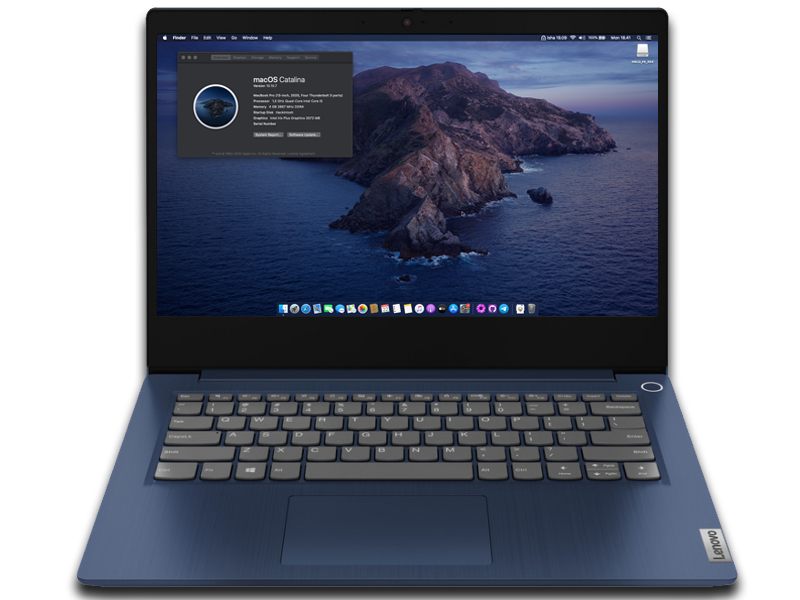

# Lenovo ideapad 3 14iil05 Hackintosh

EFI file untuk Lenovo Ideapad 3 14iil05

# Catatan
Penggunaan EFI Laptop Lenovo Ideapad 3 14iil05 di luar tanggung jawab saya, jika ada kerusakan pemasangan silahkan tanggung jawab sendiri, saya menggunakan MacOS Catalina, bisa di upgrade sampai MacOS Big Sur

# Bootloader
Saya menggunakan [OpenCore 0.6.7](https://github.com/acidanthera/OpenCorePkg)

# Spesifikasi
- <b>CPU</b>: [Intel i5-1035G4](https://ark.intel.com/content/www/id/id/ark/products/196591/intel-core-i5-1035g4-processor-6m-cache-up-to-3-70-ghz.html) Ice Lake-U
- <b>GPU</b>: Intel Iris Plus Graphics 940 Ice Lake GT2 
- <b>Penyimpanan</b>: HDD OOS500G32M 500 GB (bisa diganti SSD M.2 NVME)
- <b>RAM</b>: 4 GB DDR4 2133Mhz (bisa di upgrade, tersedia 1 slot kosong)
- <b>Layar</b>: 13.9-inch
- <b>Wifi</b>: Intel Wi-Fi 6 AX201 160MHz (saya menggunakan itlwm)
- <b>Trackpad</b>: ELAN (I2C)
- <b>Ports</b>: 1 x USB 2.0, 2 x USB 3.0, USB 2.0 SD Card Reader, HDMI Display Port, 3,5mm Jack Audio
- <b>Audio</b>: Realtek ALC230 (saya menggunakan AppleALC layout id 20)

# Yang Berfungsi
- CPU power management 
- Baterai
- Semua port USB
- Realtek ALC230 Audio (termasuk jack headphones)
- Wi-Fi & Bluetooth
- Internal webcam
- ELAN Trackpad
- Screen Brightness dengan Hotkeys
- Kunci Fn
- 10.14 Mojave, 10.15 Catalina, and Big Sur 11

## Yang Tidak Berfungsi
- Silahkan bergabung di telegram [Hackintosh Lovers](https://t.me/HackintoshLover) untuk berdiskusi.

# Setelan BIOS
Sebelum memulai, pastikan untuk mengupdate BIOS [di sini](https://pcsupport.lenovo.com/id/en/products/laptops-and-netbooks/3-series/ideapad-3-14iil05/downloads/driver-list/), setelah itu reboot, ketika logo Lenovo muncul tekan <b>F2</b>, ketika layar BIOS tampil pergi ke: 
- "Configuration" <b>SATA Controller Mode</b> rubah ke <b>AHCI</b>, <b>HotKey Mode</b> rubah ke <b>Enabled</b>.
- "Security" <b>Intel Platform Trust Technology</b> rubah ke <b>Disabled</b>, <b>Intel SGX</b> rubah ke <b>Disabled</b>, <b>Secure Boot</b> rubah ke <b>Disabled</b>.
- "Boot" <b>Boot Mode</b> rubah ke <b>UEFI</b>,<b>Fast Boot</b> rubah ke <b>Disabled</b>, <b>USB Boot</b> rubah ke <b>Enabled</b>.
- "Exit" <b>OS Optimized Defaults</b> rubah ke <b>Disabled</b>.

# Kredit
- [Apple](https://www.apple.com) for macOS.
- [Acidanthera](https://github.com/acidanthera) for most of the kexts.
- [RehabMan](https://github.com/RehabMan) for some ACPI patches.
- [Hackintosh Lovers](https://t.me/HackintoshLover) for the help.
- [Olarila](https://www.olarila.com) for guides.
- Dan semua pihak yang tidak bisa kami sebutkan satu per satu.
